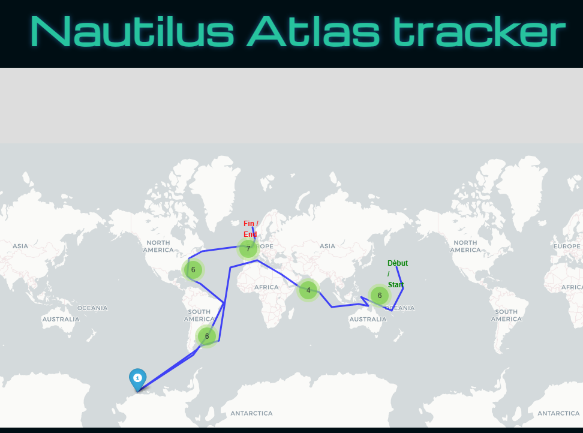

## 🧭 IA de reconstitution géographique

## 🖼️ Exemples / Captures d’écran

Voici un aperçu de la carte interactive générée par l’IA :



Ce script Python "Map_traduction.py" génère automatiquement une carte interactive du parcours du Nautilus, à partir d’un fichier json structuré. Il utilise Folium pour la cartographie, et embarque une logique d'affichage bilingue des informations (FR/EN) grâce à une fonction d’IA sémantique : `make_bilingual_popup(row)`.

Chaque escale est représentée par un marqueur interactif, et le trajet du Nautilus est reconstitué par une ligne continue sur la carte.

➡️ Objectif : allier narration littéraire et visualisation géospatiale à travers une IA légère mais évocatrice.

# The nautilus Exploration

« Une carte interactive immersive inspirée de Jules Verne, propulsée par de l’IA et du web moderne. »

---

## 🚀 Présentation

J’ai réalisé ce projet car, étant une femme très organisée, j’ai visualisé le trajet du Nautilus comme une carte mentale. Cette intuition m’a menée à relever les données géographiques extraites du livre Vingt mille lieues sous les mers de Jules Verne, puis à les structurer.

À l’aide de JupyterLab et de frameworks comme Folium, j’ai conçu une application qui calcule et affiche les coordonnées géographiques des escales du Nautilus. Le tout est enrichi par une IA embarquée qui génère des fenêtres d'information bilingues et trace le parcours complet du sous-marin sur une carte interactive.

---

## 🛠️ Fonctionnalités

🌍 Carte interactive retraçant le parcours du Nautilus

🌊 Effets visuels océaniques inspirés de la 3D

📱 Interface responsive, adaptée aux mobiles et desktop

🇫🇷🇬🇧 Affichage bilingue (français/anglais)

🧠 Génération d’un fichier HTML par l’IA embarquée dans Folium

---

## ⚙️ Installation & utilisation

1. Cloner le repo :

```bash
git clone https://github.com/tonutilisateur/nomduprojet.git

```

---

## 🛠️ Technologies utilisées

Python — langage principal

JupyterLab — environnement de développement

Folium — framework de cartographie interactive basé sur Leaflet.js

Pandas — manipulation de données tabulaires

HTML/CSS — pour styliser et structurer le rendu final

GitHub Pages — pour héberger le projet

---

## 👩‍💻 Auteur

Ce projet a été imaginé, conçu et développé par **Émilie Clain - webOara**, ingénieure autodidacte en intelligence artificielle, développeuse web et passionnée par l’univers de Jules Verne.

💡 Elle aime transformer des idées audacieuses en expériences interactives accessibles, avec une touche de magie technologique.  
🎨 Entre deux lignes de code, elle explore l’art, la musique, l’histoire… et parfois même les fonds marins.

📫 Contact pro : [LinkedIn](www.linkedin.com/in/emilieclain)
💻 Code open source disponible sur [GitHub](https://github.com/mimiecmoua/nautilus-map)
